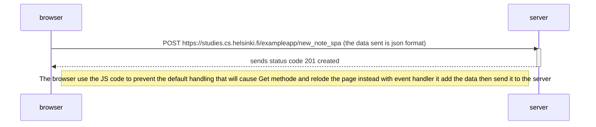

```mermaid
sequenceDiagram
    participant browser
    participant server

  


    browser->>server: POST https://studies.cs.helsinki.fi/exampleapp/new_note_spa (the data sent is json format)
    activate server
    server-->>browser: sends status code 201 created
    deactivate server
    Note right of browser: The browser use the JS code to prevent the default handling that will cause Get methode and relode the page instead with event handler it add the data then send it to the server
```
